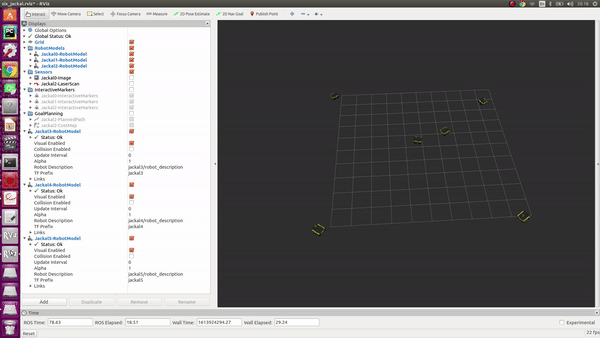

# DEWA Submission

## [Solution1](Solution1)

- [localisation package](Solution1/localisation_gpu_odom_ins)
- kalman_filter.cpp, extended_kalman_filter.cpp [custom ekf formulation](Solution1) In-progress

## [Solution2](Solution2)

- [warthog_navigation package](Solution2/warthog_navigation)

[Video link](https://youtu.be/JvXPHFNZv8E)

## [Solution3](Solution3)

- Input [TemperatureGradient.ipynb](Solution3/TemperatureGradient.ipynb)

- [jackal_swarm package](Solution3/jackal_swarm)

[Video link](https://youtu.be/LJV_LT58Zkw)

-[multi_jackal_tutorials package](Solution3/multi_jackal_tutorials)

[Video link](https://youtu.be/N3_2EN2Z1rM)

Output [RecoveredHeatMap.ipynb](Solution3/RecoveredHeatMap.ipynb)

## [Solution4](Solution4)

[Machine Learning](Solution4/DEWA_Solution4.ipynb)
