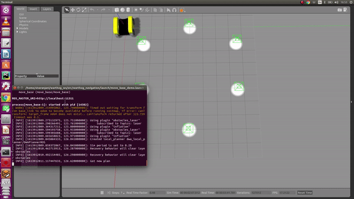

# Problem 2
 
* [Pre-requisite Installation](#installation)



Please watch the full demo [here](https://youtu.be/JvXPHFNZv8E).

## <a name="installation"/>Installation

Please watch the successful intallation demo [here](https://youtu.be/uBM2KYAWtlY).
Please follow the [**installation**](https://www.clearpathrobotics.com/assets/guides/kinetic/warthog/WarthogInstallation.html) instructions prior executing the launch file. Once the warthog_ws workspace is ready, clone this repo as a package inside it and execute:

```bash
sudo apt-get install ros-kinetic-dwa-local-planner
cd warthog_ws/
catkin_make
source devel/setup.bash 
```

## Usage

Please run the launch as follows:

```bash
roslaunch warthog_navigation warthog_waypoint_navigation.launch 

```
in Rviz, change Fixed Frame to "odom", add "RobotModel" for visulaization.

and then run in a new terminal :

```bash
source devel/setup.bash
rosrun warthog_navigation waypoint_navigation 

```
