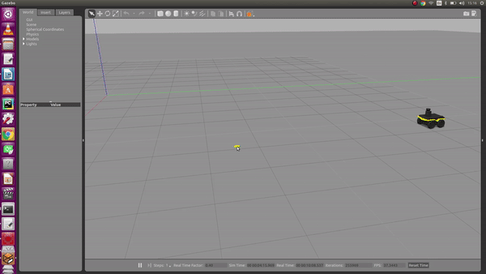
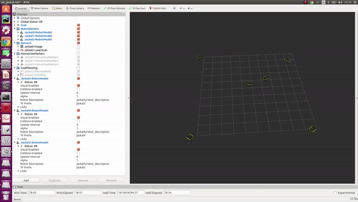

# Problem 3
 
* [Pre-requisite Installation](#installation)

## Single Jackal mapping an area of 100 meters squared



Please watch the full demo [here](https://youtu.be/LJV_LT58Zkw).

## Jackal Swarm mapping



Please watch the full demo [here](https://youtu.be/N3_2EN2Z1rM).

## <a name="installation"/>Installation

Please follow the [**installation**](https://www.clearpathrobotics.com/assets/guides/kinetic/jackal/simulation.html) instructions prior executing the launch file. Once the jackal_naivgation workspace is ready, clone these 2 repos along with the repos [here](https://github.com/NicksSimulationsROS/multi_jackal) as packages and execute:

```bash
cd jackal_navigation/
catkin_make
source devel/setup.bash 
```

## Steps to Follow

- run the [TemperatureGradient.ipynb](TemperatureGradient.ipynb) to generate temperatureActual.csv and place in [iofiles](jackal_swarm/iofiles). The sensor data in this file is published as a topic for further sensing by the robot.

- A map of 100 meters squared is created and placed in [maps](jackal_swarm/maps). 

- Please run the launch as follows:

```bash
roslaunch jackal_swarm jackal_measure_temperature.launch
```

```bash
roslaunch multi_jackal_tutorials multijackal_measure_temperature.launch 

```
- run the [RecoveredHeatMap.ipynb](RecoveredHeatMap.ipynb) to view the recovered heatmap from the Jackal generated MeasuredTemperature.csv file in [iofiles](jackal_swarm/iofiles)
